# Лабораторная работа №1

### Задание 1
```python
name = input("Имя: ")
age = int(input("Возраст: "))
print(f"Привет, {name}! Через год тебе будет {age + 1}.")
```
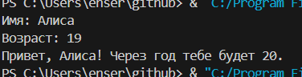

### Задание 2
```python
a = float(input("a: ").replace(',', '.'))
b = float(input("b: ").replace(',', '.'))
sum = a + b
ave = sum / 2
print(f"sum={sum:.2f}; avg={ave:.2f}")
```
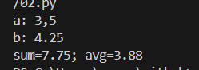

### Задание 3
```python
price = float(input("price (₽): "))
discount = float(input("discount (%): "))
vat = float(input("vat (%): "))
base = price * (1 - discount/100)
vat_amount = base * (vat/100)
total = base + vat_amount
print(f"База после скидки: {base:.2f} ₽")
print(f"НДС:               {vat_amount:.2f} ₽")
print(f"Итого к оплате:    {total:.2f} ₽")
```
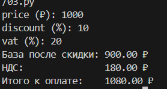

### Задание 4
```python
mins = int(input("Минуты: "))
hours = mins // 60
minutes = mins % 60
print(f"{hours}:{minutes:02d}")
```
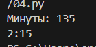

### Задание 5
```python
full_name = input("ФИО: ")
full_names = ' '.join(full_name.split())
words = full_names.split()
initials = ""
for i in words:
    if i:
        initials += i[0].upper()
print(f"Инициалы: {initials}.")
print(f"Длина (символов): {len(full_names)}")
```
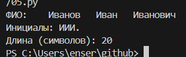

### Задание 6
```python
n = int(input())
countt = 0  
countf = 0   
for _ in range(n):
    dan = input().split()
    if dan[3] == "True":
        countt += 1
    else:
        countf += 1
print(countt, countf)
```
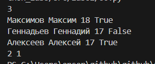

# Лабораторная работа №2

### Задание 1
```python
def min_max(nums: list[float | int]) -> tuple[float | int, float | int]:
    try:
        return tuple([min(nums), max(nums)])
    except ValueError:
        return 'ValueError'

print('min_max')
print(min_max([1, 2, 3, 4, 5]))
print(min_max([42]))
print(min_max([-5, -2, -9]))
print(min_max([]))
print(min_max([1.5, 2, 2.0, -3.1]))

def unique_sorted(nums: list[float | int]) -> list[float | int]:
    return sorted(set(nums))

print('unique_sorted')
print(unique_sorted([3, 1, 2, 1, 3]))
print(unique_sorted([]))
print(unique_sorted([-1, -1, 0, 2, 2]))
print(unique_sorted([1.0, 1, 2.5, 2.5, 0]))

def flatten(mat: list[list | tuple]) -> list:
    result = []
    for i in mat:
        if not isinstance(i, (list, tuple)):
            return "TypeError"
        result.extend(i)
    return result

print('flatten')
print(flatten([[1, 2], [3, 4]]))
print(flatten(([1, 2], (3, 4, 5))))
print(flatten([[1], [], [2, 3]]))
print(flatten([[1, 2], "ab"]))
```
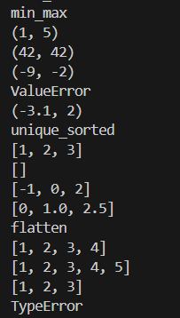

### Задание 2
```python
def transpose(mat: list[list[float | int]]) -> list[list]:
    if not mat:
        return []
    num = len(mat[0])
    if any(len(row) != num for row in mat):
        return "ValueError"
    return [[mat[i][j] for i in range(len(mat))] for j in range(num)]

print('transpose')
print(transpose([[1, 2], [3, 4]]))
print(transpose([[1], [2], [3]]))
print(transpose([[1, 2], [3, 4]]))
print(transpose([]))
print(transpose([[1, 2], [3]]))

def row_sums(mat: list[list[float | int]]) -> list[float]:
    if not mat:
        return []
    if mat and any(len(row) != len(mat[0]) for row in mat):
        return "ValueError"
    return [sum(row) for row in mat]

print('row_sum')
print(row_sums([[1, 2, 3], [4, 5, 6]]))
print(row_sums([[-1, 1], [10, -10]]))
print(row_sums([[0, 0], [0, 0]]))
print(row_sums([[1, 2], [3]]))


def col_sums(mat: list[list[float | int]]) -> list[float]:
    if not mat:
        return []
    num = len(mat[0])
    if any(len(row) != num for row in mat):
        return "ValueError"
    return [sum(mat[i][j] for i in range(len(mat))) for j in range(num)]

print('col_sums')
print(col_sums([[1, 2, 3], [4, 5, 6]]))
print(col_sums([[-1, 1], [10, -10]]))
print(col_sums([[0, 0], [0, 0]]))
print(col_sums([[1, 2], [3]]))
```
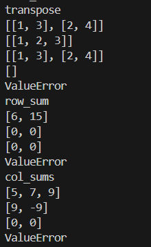

### Задание 3
```python
def format_record(rec: tuple[str, str, float]) -> str:
    fio, group, gpa = rec
    fio_parts = ' '.join(fio.split()).split()
    if len(fio_parts) < 2:
        return "ValueError"
    initials = []
    for name in fio_parts[1:]:  
        if name: 
            initials.append(f"{name[0].upper()}.")
    surname = fio_parts[0].title()
    return f"{surname} {' '.join(initials)}, гр. {' '.join(group.split())}, GPA {gpa:.2f}"

print('format_record')
print(format_record(("Иванов Иван Иванович", "BIVT-25", 4.6)))
print(format_record(("Петров Пётр", "IKBO-12", 5.0)))
print(format_record(("Петров Пётр Петрович", "IKBO-12", 5.0)))
print(format_record(("  сидорова  анна   сергеевна ", "ABB-01", 3.999)))
```
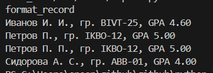

# Лабораторная работа №3

### Задание A
```python
import re

def normalize(text: str, *, casefold: bool = True, yo2e: bool = True) -> str:
    if casefold:
         text = text.casefold()
    else: text
    if yo2e:
        text = text.replace('ё','е').replace('Ё','Е') 
    else: text
    text = text.strip()
    text = re.sub(r'[\t\r\x00-\x1f\x7F]', ' ', text) 
    text = ' '.join(text.split())
    return text

def tokenize(text: str) -> list[str]:
    pattern = r'\w+(?:-\w+)*'
    tokens  = re.findall(pattern, text)
    return tokens

def count_freq(tokens: list[str]) -> dict[str, int]:
    unique_words = list(set(tokens))
    list_count = [tokens.count(i) for i in unique_words]
    dict_count = {key: word for key, word in list(zip(unique_words, list_count))}
    return dict_count

def top_n(freq: dict[str, int], n: int = 5) -> list[tuple[str, int]]:
    list_dict = list(freq.items())
    top = sorted(list_dict, key=lambda x:  x[0])
    top_plus = sorted(top, key=lambda x: x[1], reverse=True)[:n]
    return top_plus

if __name__ == "__main__":
    print('___________normalize___________')
    print(normalize("ПрИвЕт\nМИр\t"))
    print(normalize("ёжик, Ёлка"))
    print(normalize("Hello\r\nWorld"))
    print(normalize("  двойные   пробелы  "))
    print('___________tokenize___________')
    print(tokenize("привет мир"))
    print(tokenize("hello,world!!!"))
    print(tokenize("по-настоящему круто"))
    print(tokenize("2025 год"))
    print(tokenize("emoji 😀 не слово"))
    print('___________count_freq + top_n___________')
    print(count_freq(["a","b","a","c","b","a"]))
    print(count_freq(["bb","aa","bb","aa","cc"]))
    print(top_n({"a":3,"b":2,"c":1}, n=2))
    print(top_n({"aa":2,"bb":2,"cc":1}, n=2))
```


### Задание B
```python
import sys
import os
from ..lib import text as txt

def main():
    text = input()
    normalized_text = txt.normalize(text, casefold=True, yo2e=True)
    tokens = txt.tokenize(normalized_text)
    total_words = len(tokens)
    unique_words = len(set(tokens))
    freq = txt.count_freq(tokens)
    top_words = txt.top_n(freq, 5)
    print(f"Всего слов: {total_words}")
    print(f"Уникальных слов: {unique_words}")
    print("Топ-5:")
    for word, count in top_words:
        print(f"{word}:{count}")

if __name__ == "__main__":
    main()
```
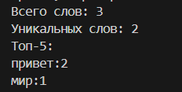

# Лабораторная работа №4

### Задание A
```python
import csv
from pathlib import Path

def read_text(path: str | Path, encoding: str = "utf-8") -> str:
    with open(path, 'r', encoding=encoding) as file:
        return file.read()

def write_csv(rows: list[tuple | list], path: str | Path, header: tuple[str, ...] | None = None) -> None:
    if rows:
        first_len = len(rows[0])
        for i, row in enumerate(rows):
            if len(row) != first_len:
                raise ValueError(f"Строка {i} имеет длину {len(row)}, ожидается {first_len}")
    ensure_parent_dir(path)
    with open(path, 'w', newline='', encoding='utf-8') as file:
        writer = csv.writer(file)
        if header is not None:
            writer.writerow(header)
        writer.writerows(rows)

def ensure_parent_dir(path: str | Path) -> None:
    Path(path).parent.mkdir(parents=True, exist_ok=True)
```
### Задание B
```python
import re
import argparse
from pathlib import Path
from io_txt_csv import read_text, write_csv

def normalize(text: str, *, casefold: bool = True, yo2e: bool = True) -> str:
    if casefold:
         text = text.casefold()
    else: text
    if yo2e:
        text = text.replace('ё','е').replace('Ё','Е') 
    else: text
    text = text.strip()
    text = re.sub(r'[\t\r\x00-\x1f\x7F]', ' ', text) 
    text = ' '.join(text.split())
    return text

def tokenize(text: str) -> list[str]:
    pattern = r'\w+(?:-\w+)*'
    tokens  = re.findall(pattern, text)
    return tokens

def count_freq(tokens: list[str]) -> dict[str, int]:
    unique_words = list(set(tokens))
    list_count = [tokens.count(i) for i in unique_words]
    dict_count = {key: word for key, word in list(zip(unique_words, list_count))}
    return dict_count

def top_n(freq: dict[str, int], n: int = 5) -> list[tuple[str, int]]:
    list_dict = list(freq.items())
    top = sorted(list_dict, key=lambda x:  x[0])
    top_plus = sorted(top, key=lambda x: x[1], reverse=True)[:n]
    return top_plus

def main():
    parser = argparse.ArgumentParser(description='Анализ текста и создание отчета')
    parser.add_argument('--in', dest='input_file', default='data/lab04/input.txt',
                       help='Входной текстовый файл (по умолчанию: data/lab04/input.txt)')
    parser.add_argument('--out', dest='output_file', default='data/lab04/report.csv',
                       help='Выходной CSV файл (по умолчанию: data/lab04/report.csv)')
    parser.add_argument('--encoding', default='utf-8',
                       help='Кодировка файла (по умолчанию: utf-8, для Windows: cp1251)')
    args = parser.parse_args()
    
    try:
        print(f"Чтение файла: {args.input_file}")
        text = read_text(args.input_file, encoding=args.encoding)
        print("Анализ текста...")
        normalized = normalize(text)
        tokens = tokenize(normalized)
        word_counts = count_freq(tokens)
        sorted_words = sorted(word_counts.items(), 
                             key=lambda x: (-x[1], x[0]))
        print(f"Сохранение отчета: {args.output_file}")
        rows = [(word, count) for word, count in sorted_words]
        header = ("word", "count")
        write_csv(rows, args.output_file, header)
        print("\n--- ОТЧЕТ ---")
        print(f"Всего слов: {len(tokens)}")
        print(f"Уникальных слов: {len(word_counts)}")
        print("Топ-5:")
        freq = count_freq(tokens)
        top_words = top_n(freq, 5)
        for word, count in top_words:
            print(f"{word}:{count}")
        print(f"\nОтчет сохранен в: {args.output_file}")
        
    except FileNotFoundError:
        return 'FileNotFoundError'
    except UnicodeDecodeError:
        return 'UnicodeDecodeError'
    except Exception:
        return 'Exception'

if __name__ == "__main__":
    main()
```
### Тесты
#### #1
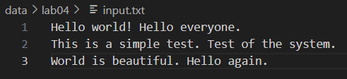
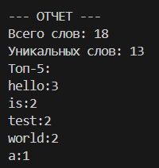
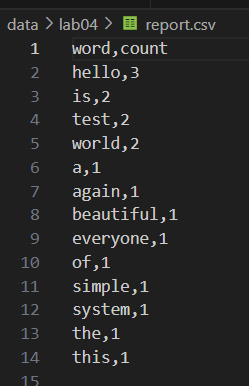
#### #2
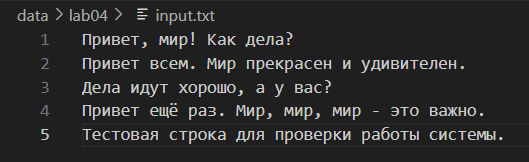
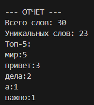
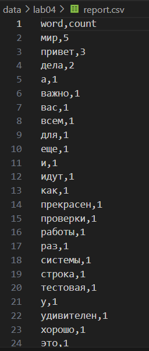
#### #3
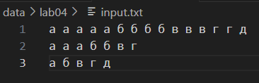
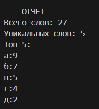
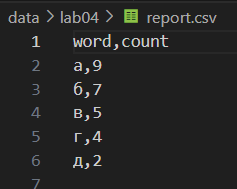

# Лабораторная работа №5

### Задание A
```python
import json
import csv
from pathlib import Path # для работы с путями файлов

def json_to_csv(json_path: str, csv_path: str) -> None:
    json_file = Path(json_path)
    csv_file = Path(csv_path)
    if not json_file.is_file(): 
        raise FileNotFoundError("FileNotFoundError")
    with json_file.open("r", encoding="utf-8") as f: # открытие файла в UTF-8
        try:
            data = json.load(f) # парсинг JSON в Python объект
        except json.JSONDecodeError as e:
            raise ValueError("ValueError")
    if not data or not isinstance(data, list): # проверка: не пустой ли список
        raise ValueError("ValueError")
    if not all(isinstance(item, dict) for item in data): # все элементы - словари
        raise ValueError("ValueError")
    first_keys = list(data[0].keys())    # ключи из первого объекта 
    all_keys = set(first_keys)           # множество всех уникальных ключей
    for item in data[1:]:                # проходим по остальным объектам
        all_keys.update(item.keys())     # добавляем новые ключи в множество
    additional_keys = sorted(all_keys - set(first_keys))  # новые ключи по алфавиту
    fieldnames = first_keys + additional_keys  # итоговый порядок колонок
    with csv_file.open("w", encoding="utf-8", newline="") as f:  # открытие на запись
        writer = csv.DictWriter(f, fieldnames=fieldnames)  # создание writer с колонками
        writer.writeheader()  # записываем заголовоки
        for item in data:     
            row = {key: item.get(key, "") for key in fieldnames}  # создаем строку, заполняя пустые поля
            writer.writerow(row)  # записываем строку в CSV

json_to_csv(f"data/lab05/samples/example1.json", f"data/lab05/out/example1_json.csv")

def csv_to_json(csv_path: str, json_path: str) -> None:
    csv_file = Path(csv_path)
    json_file = Path(json_path)
    if not csv_file.is_file(): 
        raise FileNotFoundError("FileNotFoundError")
    with csv_file.open("r", encoding="utf-8", newline="") as f:
        reader = csv.DictReader(f) # создаем reader, который вернет словари
        if reader.fieldnames is None: # проверяем, есть ли заголовок
            raise ValueError("ValueError")
        data = list(reader) # все строки в список словарей
    if not data:
        raise ValueError("ValueError")
    with json_file.open("w", encoding="utf-8") as f: # открытие на запись
        json.dump(data, f, ensure_ascii=False, indent=2) # ensure_ascii=False - сохраняет кириллицу, indent=2 - форматирование с отступами

csv_to_json(f"data/lab05/samples/example2.csv", f"data/lab05/out/example2_csv.json")
```
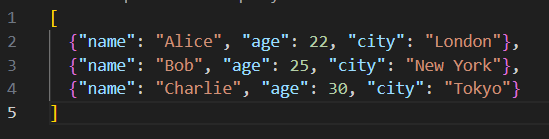
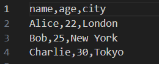
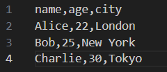
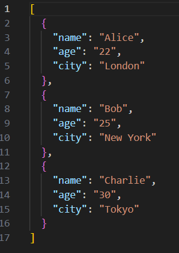

### Задание B
```python
from openpyxl import Workbook # импорт класса для создания Excel файлов
import csv
from pathlib import Path

def csv_to_xlsx(csv_path: str, xlsx_path: str) -> None:
    csv_file = Path(csv_path)
    xlsx_file = Path(xlsx_path)
    if not csv_file.is_file():
        raise FileNotFoundError("FileNotFoundError")
    wb = Workbook()      # создаем новую Excel книгу
    ws = wb.active       # получаем активный лист
    ws.title = "Sheet1"  # переименовываем лист
    with csv_file.open("r", encoding="utf-8", newline="") as f:
        reader = csv.reader(f)  # создаем CSV reader
        rows = list(reader)  # читаем все строки в список списков
    if not rows:
        raise ValueError("ValueError")
    for row in rows:
        ws.append(row) # добавляем строку в Excel лист
    for col_idx, col_cells in enumerate(ws.columns, start=1): # ws.columns - генератор всех колонок листа, enumerate(..., start=1) - получаем индекс колонки
        max_length = max(len(str(cell.value)) if cell.value is not None else 0 for cell in col_cells) # для каждой колонки находим максимальную длину текста, находим максимальную длину среди всех ячеек колонки
        adjusted_width = max(max_length, 8) # устанавливаем ширину как максимум
        col_letter = ws.cell(row=1, column=col_idx).column_letter # получаем букву колонки из первой ячейки колонки
        ws.column_dimensions[col_letter].width = adjusted_width # устанавливаем вычисленную ширину для колонки
    wb.save(xlsx_file)

csv_to_xlsx('data/lab05/samples/example2.csv', 'data/lab05/out/example3_csv.xlsx')
```

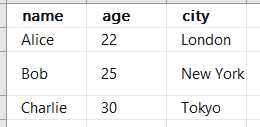

# Лабораторная работа №6

### Задание cli_text
```python
import  argparse # для парсинга аргументов командной строки
from src.lib.text import *

def cat(text, n):
    f = open(text, "r").readlines()  # открываем файл и читаем все строки в список
    if not n:                        # если флаг -n НЕ установлен
        for i in f:                  # проходим по всем строкам
            print(i.replace("\n", ""))  # выводим строку без символа новой строки
    else:                            # если флаг -n установлен
        f = enumerate(f)             # нумеруем строки (индекс, строка)
        for i in f:                  # проходим по пронумерованным строкам
            print(i[0],i[1].replace("\n", ""))  # выводим номер и строку

def stats(txt,n):
    f = open(txt, "r").read()        # читаем весь файл как одну строку
    txt = top_n(count_freq(tokenize(normalize(f))),n)  # цепочка обработки текста
    for a in txt:                    # проходим по результату
        print(a[1],a[0])             # выводим частоту и слово

parser = argparse.ArgumentParser("CLI‑утилиты лабораторной №6") # создаем главный парсер
subparsers = parser.add_subparsers(dest="command") # добавляем подпарсеры для команд

cat_parser = subparsers.add_parser("cat",help = "Вывести содержимое файла")  # создаем парсер для cat
cat_parser.add_argument("--input",required = True)  # обязательный аргумент --input
cat_parser.add_argument("-n", action="store_true",help = "Нумировать строки")  # флаг -n (нумерация строк)

stats_parser = subparsers.add_parser("stats",help = "Частоты слез")  # создаем парсер для stats
stats_parser.add_argument("--input",required = True) 
stats_parser.add_argument("--top",type = int, default = 5)  # аргумент --top (по умолчанию 5)

args = parser.parse_args()  # парсим аргументы командной строки

if args.command == "cat":  
    cat(args.input,args.n)  # вызываем функцию cat с файлом и флагом -n

if args.command == "stats": 
    stats(args.input,args.top)  # вызываем функцию stats с файлом и числом top
```
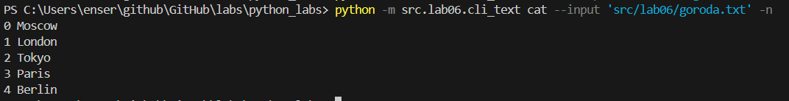
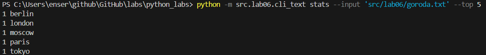

### Задание cli_convert
```python
import argparse
from src.lab05.csv_xlsx import csv_to_xlsx
from src.lab05.json_csv import json_to_csv, csv_to_json

parser = argparse.ArgumentParser("CLI‑утилиты лабораторной №6") # создаем главный парсер 
subparsers = parser.add_subparsers(dest="command") # добавляем подпарсеры для разных команд. 
# dest="command" сохраняет выбранную команду в args.command

json2csv_parser = subparsers.add_parser("json2csv")  # создаем подпарсер
json2csv_parser.add_argument("--in", required=True, dest='input')  # добавляем обязательный аргумент --in
# dest='input' переименовывает его в args.input
json2csv_parser.add_argument("--out", required=True)  # добавляем обязательный аргумент --out для выходного файла

csv2json_parser = subparsers.add_parser("csv2json")
csv2json_parser.add_argument("--in",required=True,dest='input')  # обязательный входной файл (--in → args.input)
csv2json_parser.add_argument("--out",required=True) # обязательный выходной файл

csv2xlsx_parser = subparsers.add_parser("csv2xlsx")
csv2xlsx_parser.add_argument("--in",required=True,dest='input') # входной файл CSV
csv2xlsx_parser.add_argument("--out",required=True) # выходной файл XLSX

args = parser.parse_args() # парсим аргументы командной строки, переданные при запуске программы

if args.command == "json2csv":
    json_to_csv(args.input,args.out)
    print("Выполнено")

if args.command == "csv2json":
    csv_to_json(args.input,args.out)
    print("Выполнено")

if args.command == "csv2xlsx":
    csv_to_xlsx(args.input,args.out)
    print("Выполнено")
```
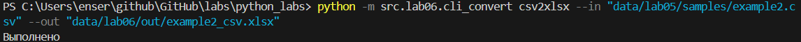
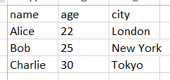

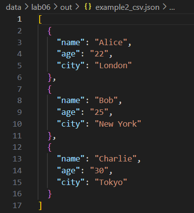
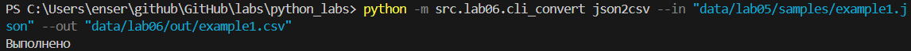
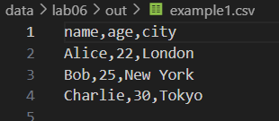
